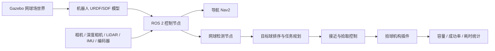

# 网球捡球机器人 Gazebo 仿真方案

## 1. 结论

可以使用 Gazebo 做网球捡球机器人仿真，尤其适合在实体样机前验证底盘运动、拾球机构、传感器布置、路径规划、避障、容量策略和任务效率。

建议技术选型：

- ROS 2 + Gazebo Harmonic / Gazebo Sim
- 如团队已有 ROS 1 经验，也可使用 Gazebo Classic，但新项目不建议从 Classic 开始

第一版仿真目标应聚焦系统级闭环，而不是把 Gazebo 结果直接当作实车性能预测：

> 在硬地标准网球场，随机散落 50 个球，机器人 5 分钟内自动捡起 45 个以上，并输出路径和失败原因。

该 KPI 主要用于验证算法流程、软件架构、任务闭环和方案对比，不应直接等同于实车验收指标。真实拾球率、边角球能力、卡球率和机构可靠性必须通过物理台架与实车测试回标。

## 2. 仿真目标

1. 验证机器人能否在标准网球场内自主巡航、识别网球、靠近并拾取。
2. 比较不同底盘方案：差速轮、四轮滑移、麦克纳姆轮。
3. 比较不同拾球机构：滚刷、拨轮、输送带、前铲导向。
4. 评估拾球效率：50 球耗时、漏球率、卡球率、边角球成功率。
5. 为后续实车控制代码复用打基础。

仿真结果的使用边界：

- Gazebo 适合验证系统能否跑通、模块接口是否合理、控制流程是否稳定。
- Gazebo 不适合单独预测真实拾球成功率、软刷毛效果、网球滚动/弹跳细节和卡球概率。
- 所有关键性能指标都需要在物理台架或实车阶段重新标定。

## 3. 推荐仿真架构

## 4. 场景建模

建立一个标准网球场世界。

| 模块 | 仿真内容 |
|---|---|
| 场地 | 标准硬地球场尺寸、边线、中线、发球线、球网、围栏 |
| 地面 | 高摩擦硬地，后续可扩展红土/草地 |
| 球 | 直径约 67 mm，质量约 58 g，黄色材质 |
| 障碍 | 球筐、发球机、球拍、人形动态障碍、网柱 |
| 光照 | 室内、室外、阴影、低光照 |
| 球分布 | 随机散落、边角集中、网边集中、发球机区域集中 |

## 5. 机器人模型

第一版可以做一个接近真实产品的简化模型。

| 子系统 | 建议方案 |
|---|---|
| 底盘 | 差速轮优先，结构简单、控制稳定、成本低 |
| 尺寸 | 约 600 x 450 x 350 mm |
| 速度 | 0.4-1.0 m/s |
| 传感器 | 前置 RGB-D 相机 + 低成本 2D LiDAR + IMU + 轮速编码器 |
| 拾球口 | 前置，宽 350-450 mm |
| 储球仓 | 60-80 球 |
| 急停 | 仿真中保留碰撞停止逻辑 |
| 倒球 | 后置或顶部翻斗，第二阶段仿真 |

## 6. 拾球机构仿真

Gazebo 对柔性刷毛、真实挤压这类复杂接触不太友好，因此建议分两层仿真。

### 6.1 任务级仿真

机器人进入球的拾取区域后，插件判断是否拾取成功。判断条件包括距离、角度、速度、拾球口朝向、仓内容量等。

任务级插件的判定阈值只能作为软件闭环验证工具，不能直接代表真实机构可行性。后续需要通过物理台架数据回标这些阈值，例如拾球口有效宽度、最大允许入射角、推荐接近速度和不同球况下的成功率。

### 6.2 机构级仿真

对滚刷、拨轮、输送带做简化刚体建模，只验证尺寸、碰撞、入口姿态和卡球风险。真正的刷毛弹性建议使用 CAD + 物理台架验证，不建议把 Gazebo 作为精密机构仿真工具。

对拾球入口这一小段机构，建议额外做局部高保真验证：

- 使用 MuJoCo、Adams 或同类动力学工具，对球与滚刷/拨轮/导向板的接触过程做局部仿真。
- 重点验证球入口姿态随机性、多球同时进入、滚刷转速、摩擦系数、拥堵和卡球边界。
- 局部高保真仿真只覆盖拾球入口，不需要模拟整车导航，避免复杂度失控。
- 最终仍以实体机构台架作为主验证手段。

拾球成功判定建议：

| 条件 | 建议阈值 |
|---|---:|
| 球到拾球口中心距离 | < 0.18 m |
| 球在拾球口宽度内 | 是 |
| 机器人速度 | < 0.6 m/s |
| 夹角偏差 | < 25 deg |
| 仓内未满 | 是 |

## 7. 视觉检测方案

仿真初期可以使用颜色阈值 + 深度定位快速跑通闭环，但该方案在真实场地中的鲁棒性有限。建议从 P2 阶段开始并行接入轻量级深度学习检测方案。

推荐路线：

| 阶段 | 检测方案 | 目标 |
|---|---|---|
| P1 | 颜色阈值 + 深度定位 | 快速打通仿真闭环 |
| P2 | 轻量 YOLO / RT-DETR 小模型 | 验证端到端检测延迟和算力需求 |
| P3 | 合成数据 + 少量真实数据混训 | 初步缩小仿真到真实的 domain gap |
| P4 | 真实场地数据回放测试 | 评估误检、漏检、阴影和遮挡问题 |

检测模块需要输出：

- 球的 2D 框
- 球的 3D 坐标
- 置信度
- 是否可拾取的状态估计
- 检测延迟和帧率

## 8. 仿真到实车闭环

为避免仿真和实车脱节，需要规划 sim-to-real 回标流程。

### 8.1 传感器模型标定

| 传感器 | 需要建模/标定的参数 |
|---|---|
| RGB 相机 | 分辨率、视场角、畸变、曝光、运动模糊、噪声 |
| 深度相机 | 深度噪声、空洞、最小/最大测距、低反射误差 |
| LiDAR | 扫描频率、角分辨率、测距噪声、盲区 |
| IMU | 零偏、随机游走、安装姿态 |
| 编码器 | 分辨率、打滑、左右轮半径误差 |

### 8.2 Domain Gap 评估

需要比较仿真和真实场景中的关键差异：

- 检测误检率和漏检率
- 球的真实滚动距离和停止分布
- 机器人低速对准误差
- 贴边球拾取成功率
- 不同光照下的图像质量
- 实车打滑和定位漂移

### 8.3 实车数据回标

实车测试后需要反向更新仿真参数：

- 地面摩擦系数
- 轮胎打滑模型
- 传感器噪声模型
- 拾球插件成功阈值
- 边角球失败模型
- 机器人最大安全速度

## 9. 软件模块方案

| 模块 | 说明 |
|---|---|
| tennis_court_world | Gazebo 世界、球场、球网、障碍物 |
| ball_picker_description | 机器人 URDF/Xacro、传感器、关节、碰撞模型 |
| ball_picker_gazebo | 拾球插件、随机撒球插件、统计插件 |
| ball_detector | 基于 RGB/深度的网球检测，仿真先用颜色阈值 + 深度定位 |
| mission_planner | 球目标排序，优先最近球、聚类区域、边角球 |
| nav2_config | ROS 2 Nav2 导航、代价地图、局部规划器 |
| pickup_controller | 接近球、低速对准、拾取确认、失败重试 |
| evaluation | 耗时、路径长度、拾球数、漏球数、碰撞次数统计 |

## 10. 工程基础设施

对于 3-6 个月的仿真项目，建议从一开始补齐基础设施，避免后期难以复现实验结论。

| 能力 | 建议方案 |
|---|---|
| CI/CD | 每次提交自动运行单元测试、基础 launch 测试、无头 Gazebo smoke test |
| 场景版本管理 | 将球场、障碍物、球分布 seed、光照参数纳入配置文件 |
| 数据记录 | 使用 rosbag2 记录图像、点云、tf、里程计、目标球列表和控制指令 |
| 数据回放 | 支持离线回放检测和规划模块，便于定位误检/漏检问题 |
| 实验追踪 | 每次仿真记录 commit id、场景 id、随机种子、参数文件和结果指标 |
| 多人协作 | main 分支保持可运行，功能分支开发，PR 必须附带仿真复现实验 |
| 指标报表 | 自动输出拾球数、耗时、路径长度、失败原因和碰撞次数 |

## 11. 底盘对比基准

若比较差速轮、四轮滑移和麦克纳姆轮，需要定义统一基准，避免仿真结论失真。

统一对比条件：

- 使用同一组球分布随机种子
- 使用同一套检测算法和任务规划算法
- 使用同一组障碍物、光照和球场模型
- 限制相同最大速度、加速度和安全距离
- 记录同样的评价指标

底盘对比维度：

| 维度 | 说明 |
|---|---|
| 拾球耗时 | 完成 50 球所需时间 |
| 接近成功率 | 单球接近并进入拾球口的成功率 |
| 贴边能力 | 边线、围网、网柱附近球的处理能力 |
| 路径长度 | 总移动距离 |
| 能耗估计 | 基于电机输出的相对能耗 |
| 维护风险 | 轮组复杂度、磨损、成本和清洁难度 |
| 仿真置信度 | 轮地接触模型与实车的一致性 |

注意：麦克纳姆轮在 Gazebo 中的侧向摩擦和滚子接触模型可能不够准确。即使仿真显示其更灵活，也需要结合实车成本、轮子磨损、场地灰尘、维护难度和噪声综合判断。

## 12. MVP 开发阶段

| 阶段 | 时间 | 目标 |
|---|---:|---|
| P0 | 1-2 周 | 搭建 ROS 2 + Gazebo，完成球场、机器人、随机撒球 |
| P1 | 2-3 周 | 实现手动遥控拾球与拾球成功判定插件 |
| P2 | 3-4 周 | 接入相机检测、球坐标转换、自动接近单个球，并并行验证轻量神经网络检测 |
| P3 | 3-4 周 | 接入 Nav2，实现多球任务规划和避障 |
| P4 | 2-3 周 | 做 50 球、100 次随机场景评测，输出结构/算法优化建议和仿真置信度说明 |
| P5 | 3-6 周 | 加入倒球、边角球、动态人障碍、多底盘方案对比 |

## 13. 关键评测指标

| 指标 | MVP 目标 |
|---|---:|
| 50 球拾取时间 | <= 5 分钟 |
| 硬地随机球拾取率 | >= 90% |
| 边线/围栏附近拾取率 | >= 70% |
| 单球平均接近失败次数 | <= 1.3 次 |
| 碰撞次数 | 0 次严重碰撞 |
| 漏检率 | <= 10% |
| 假阳性率 | <= 5% |
| 仓满识别准确率 | 100% |

这些指标用于仿真阶段的方案横向比较。进入实车阶段后，需要重新定义实体样机验收指标，并标注哪些指标由仿真继承、哪些指标必须实测。

## 14. 技术风险

1. Gazebo 不能高保真模拟软刷毛和网球真实弹跳/挤压，需要实体小样验证。
2. 黄色球在黄色/绿色场地、强光阴影下可能误检，需要后续上真实数据训练模型。
3. 贴墙、贴网柱、贴围栏球是难点，可能需要侧向拾球能力或专门贴边策略。
4. 差速底盘便宜稳定，但贴边对准不如麦克纳姆轮灵活。
5. 如果目标是商用产品，仿真代码最好从第一天就按 ROS 2 实车可复用架构写。
6. Gazebo 中得出的 90% 拾取率等结果对实车预测价值有限，必须通过台架和实车回标。
7. 麦克纳姆轮等复杂轮地接触模型在仿真中可能偏乐观。
8. 如果没有 rosbag、场景版本和随机种子管理，仿真结果难以复现。

## 15. 推荐路线

先用 Gazebo 做系统级仿真，验证导航、识别、调度和拾球流程；同时做一个简化拾球机构台架，验证滚刷/输送带。两条线并行，效率最高。

建议第一版产品仿真不要追求复杂场景全覆盖，而是围绕一个清晰验收标准推进，同时明确其定位为算法流程验证和架构验证：

> 在硬地标准网球场，随机散落 50 个球，机器人 5 分钟内自动捡起 45 个以上，并输出路径和失败原因。

最终研发路径建议：

1. Gazebo 跑通整车任务闭环。
2. 轻量神经网络检测尽早进入仿真链路，验证延迟和算力。
3. 拾球入口使用局部高保真仿真或物理台架提前验证。
4. 实车测试后持续回标传感器、摩擦、定位和拾球阈值。
5. 用统一场景集和可复现实验数据比较底盘、算法和机构方案。
